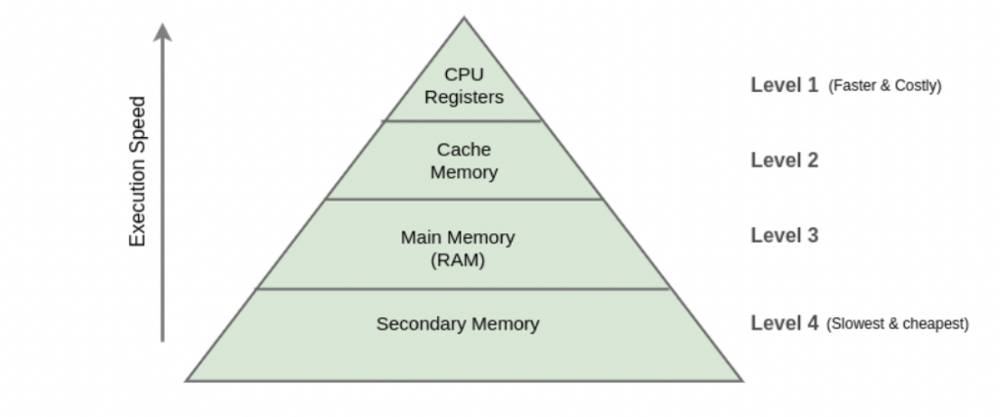
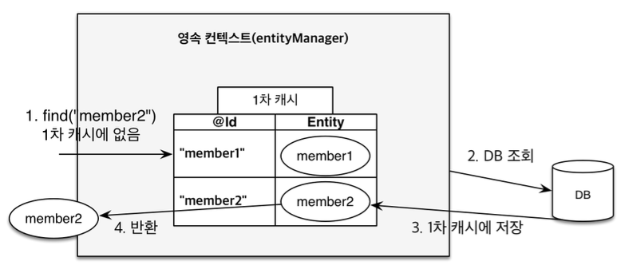
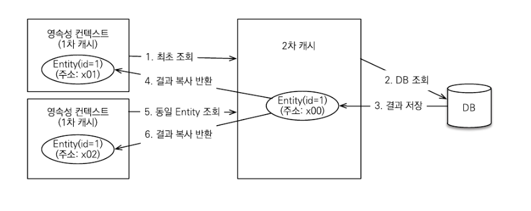

## 캐시 (Cache)

- '사용되었던 데이터는 다시 사용될 가능성이 높다'는 개념을 이용하여 데이터나 값을 미리 복사해 놓는 임시 장소

- 우리가 생각하는 것보다 네트워크를 통해 데이터베이스에 접근하는 시간 비용은 애플리케이션 서버에서 내부 메모리에 접근하는 시간 비용보다 훨씬 비싸다.

- 위로 올라갈수록 <u>용량이 적고 가격이 비싸지만, 속도가 빠른</u> 것을 알 수 있다.

- Secondary Memory는 SDD, HDD이다. 즉, 데이터베이스는 Secondary Memory에 저장된다. 그래서 캐시 메모리에 접근하면 훨씬 더 빠르다.

- 조회한 데이터를 메모리에 캐싱하여 데이터베이스 접근 횟수를 줄이면 애플리케이션 성능을 개선할 수 있어!

#### 캐시의 종류
- CPU - L1, L2, L3
    - L1 캐시는 CPU 내부에 위치하며, L2 캐시는 L1 캐시와 메인 메모리 사이에 위치한다.
    - L3 캐시는 여러 CPU 코어가 공유하는 캐시이다.
- DRAM, HDD
    - DRAM은 메모리에 저장된 데이터를 빠르게 읽고 쓸 수 있지만, 전원이 꺼지면 데이터가 사라진다.
    - HDD는 데이터를 영구적으로 저장할 수 있지만, DRAM보다 느리다.
- CDN
    - CDN(Content Delivery Network)은 웹 콘텐츠를 전 세계 여러 곳에 분산하여 제공하는 서비스이다.
- HTTP Cache
    - HTTP Cache는 웹 브라우저나 CDN, 프록시 서버 등에 저장된 캐시이다.
- Application Cache
    - 애플리케이션 내부에 저장된 캐시이다.
- Proxy Cache
    - 프록시 서버에 저장된 캐시이다.

## 1차 캐시 (First-Level Cache)

- 1차 캐시는 영속성 컨텍스트 내부에 엔티티를 저장하여 빠른 데이터 조회와 업데이트를 지원하는 메모리 기반 캐시이다.

- 1차 캐시는 **객체의 동일성**을 보장한다.

### [ 1차 캐시 조회 과정 ]

**1\) 1차 캐시에 엔티티가 있는 경우**

- 엔티티 조회
- 1차 캐시에서 결과 반환

**2\) 1차 캐시에 엔티티가 없는 경우**

- 엔티티 조회
- 데이터베이스 조회
- 1차 캐시에 결과 저장
- 저장한 결과 반환

최종적으로 트랜잭션이 커밋되거나 플러시를 호출하면 1차 캐시의 엔티티 변경 내역이 데이터베이스에 동기화된다.

 

### [ 1차 캐시 한계 ]

- 1차 캐시는 <u>**트랜잭션 범위**</u> 내에서만 유효하다.
- 트랜잭션이 커밋되거나 롤백되면 1차 캐시에 저장된 엔티티는 삭제되고, 다음 트랜잭션에서는 다시 데이터베이스에서 조회하게 된다.

 

## 2차 캐시 (Second-Level Cache)

- 애플리케이션에서 공유하는 캐시를 JPA는 공유 캐시(Shared Cache)라고 한다. 일반적으로 2차 캐시 (Second Level Cache, L2 Cache)라고 부른다.
- 2차 캐시는 애플리케이션 범위의 캐시이다.
- 따라서 애플리케이션을 종료할 때까지 캐시가 유지된다.
- 2차 캐시는 영속성 컨텍스트가 다르면 **객체 동일성을 보장하지 않는다.**

### [ 2차 캐시 조회 과정 ]

**1\) 2차 캐시에 엔티티가 있는 경우**

- 엔티티 조회
- 2차 캐시에서 결과 반환

**2\) 2차 캐시에 엔티티가 없는 경우**

- 엔티티 조회
- 데이터베이스 조회
- 2차 캐시에 결과 저장
- 2차 캐시는 **복사본**을 만들어서 1차 캐시에 반환

 

### 2차 캐시에서 복사본을 반환하는 이유

- 동시성 이슈 때문이다.
    - 동시성 이슈란 여러 스레드가 동시에 같은 자원에 접근할 때 발생하는 문제이다.

- 만약 캐시한 객체를 그대로 반환하면 **멀티 스레드 환경에서 동시성 이슈**가 발생할 수 있다. 즉, 캐시 한 객체를 여러 곳에서 수정하는 문제가 발생할 수 있다.

- 이를 해결하기 위해 `락(Lock)`을 거는 방법도 있는데, `락(Lock)`을 사용해서 해결하는 것보다 객체를 복사해서 반환하는 것의 비용이 더 저렴하다고 한다.

 

### 실무에서 2차 캐시 사용

- 하이버네이트 2차 캐시보다는 스프링이 지원하는 캐시를 서비스 계층에서 사용하는 게 더 효과적이다.

- 2차 캐시는 설정도 복잡하고, 지원하는 캐시 라이브러리도 작습니다.

- 실무에서는 <u>서비스 계층에서 복잡하게 외부 API도 호출하고, 여러 엔티티도 조회</u>해서 그 결과로 **DTO를 생성**합니다. 스프링을 사용하면 이 **DTO를 효과적으로 캐시** 할 수 있고, 지원하는 캐시 라이브러리도 풍부하다.

- 2차 캐시는 단순히 엔티티 조회(쿼리포함)와 관련된 부분만 캐시가 지원된다.
