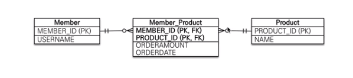
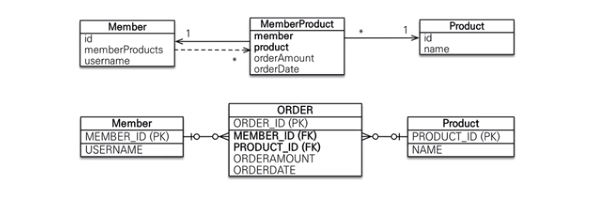

# M:N 연결하는 상황



<br>

## Member 클래스

```java
@Entity
public class Member {

	@Id
    @Column(name = "MEMBER_ID")
    private Long id;

    @ManyToMany
    @JoinTable(name = "member_product,
    		  joinColumns = @JoinColumn(name = "MEMBER_ID"),
              inverseJoinColumn = @JoinColumn(name = "PRODUCT_ID"))
    private List<Product> products = new ArrayList<>();

    @Column(name = "USERNAME")
    private String username;

	// Getter, Setter, Constructor
}
```

Join Table 어노테이션을 통해 Member 클래스와 Product 클래스을 연결하는 중간 클래스를 생성한다. 그 테이블에는 MEMBER_ID와 PRODUCT_ID가 들어간다.

<br>

## Product 클래스

```java
@Entity
public class Product {

    @Id
    @Column(name = "PRODUCT_ID")
    private Long id;

    @ManyToMany(mappedBy = "products")
    private List<Member> members = new ArrayList<>();

    @Column(name = "NAME")
    private String name;

    // Getter, Setter, Constructor
}
```

## M:N의 문제점

- 중간 테이블이 없어서 추가적인 정보를 저장할 수 없다.
- 중간 테이블이 없어서 엔티티를 추가하거나 삭제할 때, 모든 데이터를 삭제하고 다시 추가해야한다.
- 중간 테이블이 생성되지만, 숨겨져 있기 때문에 출력을 할때 복잡한 조인으로 쿼리가 발생 할 수 도 있다.
- 중간 테이블에 필요한 컬럼을 저장하고 다른 정보가 저장되는 것이 불가능하다.


<br>

# 해결 방법



### Member 클래스

```java
@Entity
public class Member {

    @Id
    @Column(name = "MEMBER_ID")
    private Long id;

	// 연결 테이블(MEMBER_PRODUCT)쪽이 외래키를 갖고있기 때문에, 연결 테이블이 연관관계의 주인이다.
    @OneToMany(mappedBy = "member")
    private List<MemberProduct> memberProducts = new ArrayList<>();

    @Column(name = "USERNAME")
    private String username;

    // Getter, Setter, Constructor

}
```

<br>

### Product 클래스

```java
@Entity
public class Product {

    @Id
    @Column(name = "PRODUCT_ID")
    private Long id;

    @Column(name = "NAME")
    private String name;

    // Getter, Setter, Constructor
}
```

<br>

### Order 클래스

```java
@Table(name = "ORDERS")
@Entity
public class MemberProduct {

    @Id
    @Column(name = "ORDER_ID")
    private Long id;

    @ManyToOne
    @JoinColumn(name = "MEMBER_ID")
    private Member member;

    @ManyToOne
    @JoinColumn(name = "PRODUCT_ID")
    private Product product;

    @Column(name = "ORDERAMOUNT")
    private Integer orderAmount;

    @Column(name = "ORDERDATE")
    private LocalDateTime orderDate;

    // Getter, Setter, Constructor
}
```

다대다 방식을 일대다, 다대일로 풀어서 활용하는 방식이 있다.

위와 같은 방식으로 바꾸면 앞의 단점들을 해결 할수 있다.
