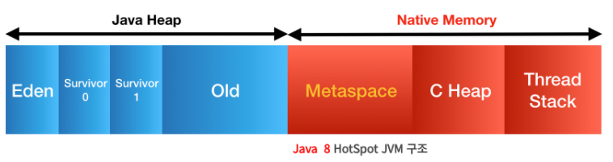

## Java 8 특징

### 1. 람다 표현식

- 람다 표현식은 익명 함수의 선언을 간단하게 만들어주는 것이다. 람다 표현식은 메서드로 전달할 수 있는 익명 함수를 단순화한 것이다. 람다 표현식은 함수형 프로그래밍 스타일을 채택한 것이다. 람다 표현식은 코드를 간결하게 만들어주는 장점이 있다.

### 2. 함수형 인터페이스

- 함수형 인터페이스는 하나의 추상 메서드를 가지고 있는 인터페이스이다. 함수형 인터페이스는 람다 표현식을 사용할 수 있게 해준다. 함수형 인터페이스는 @FunctionalInterface 어노테이션을 사용하여 선언한다.

```java
@FunctionalInterface
public interface Math {
    public int Callc(int first, int secont);
}

public class Main {
    public static void main(String[] args) {
        // 람다 표현식 방법
        Math plusLambda = ((first, secont) -> first + secont);
        System.out.println(plusLambda.Callc(4,2));

        // 추상 메서드 오버라이딩 구현 방법
        Math minusLambda = new Math() {
            @Override
            public int Callc(int first, int secont) {
                return first - secont;
            }
        };
        System.out.println(minusLambda.Callc(4,2));
    }
}
```

### 3. 메소드 참조

- 람다식을 더 간결하게 표현하는 방법으로, 람다식에서 불필요한 매개변수를 제거하고, 메서드의 이름을 직접 참조하는 방법이다.

- 메소드 참조는 `::` 기호를 사용하여 표현한다.

```java
// 람다식
Function<String, Integer> function = (str) -> str.length();

// 메소드 참조
Function<String, Integer> function = String::length;
```

### 4. 디폴트 메서드

- 인터페이스에 메서드를 추가할 수 있게 해주는 것이다. 디폴트 메서드는 인터페이스를 구현하는 클래스에서 메서드를 오버라이딩하지 않아도 된다.

```java
public interface Math {
    public int Callc(int first, int secont);

    default int add(int first, int secont) {
        return first + secont;
    }
}

public class Main {
    public static void main(String[] args) {
        Math math = new Math() {
            @Override
            public int Callc(int first, int secont) {
                return first - secont;
            }
        };
        System.out.println(math.add(4,2));
    }
}
```

### 5. Stream API

- Stream API는 Java 8에서 추가된 기능으로, 컬렉션을 함수형 프로그래밍 방식으로 처리할 수 있게 해준다. Stream API는 데이터를 추출하고, 변환하고, 필터링하고, 그룹화하는 등의 작업을 할 수 있다.

```java
import java.util.Arrays;

public class Main {
    public static void main(String[] args) {
        int[] arr = {1, 2, 3, 4, 5};

        // Stream API를 사용하지 않은 경우
        int sum = 0;
        for (int i : arr) {
            sum += i;
        }
        System.out.println(sum);

        // Stream API를 사용한 경우
        sum = Arrays.stream(arr).sum();
        System.out.println(sum);
    }
}
```

### 6. Optional

- Optional은 null을 다루는 방법을 제공한다. Optional은 null을 직접 다루지 않고, null을 감싸서 다루는 방법이다. Optional은 null 체크를 간단하게 만들어준다.

```java
import java.util.Optional;

public class Main {
    public static void main(String[] args) {
        String str = "Hello World";

        // Optional을 사용하지 않은 경우
        if (str != null) {
            System.out.println(str.length());
        }

        // Optional을 사용한 경우
        Optional<String> optional = Optional.ofNullable(str);
        optional.ifPresent(s -> System.out.println(s.length()));
    }
}
```

#### Optional 메서드

- Optional.of(T value) : null이 아닌 객체를 감싸는 Optional 객체를 생성한다.
- Optional.ofNullable(T value) : null인 객체를 감싸는 Optional 객체를 생성한다.

> of()는 null이면 NullPointerException이 발생하지만, ofNullable()은 null이어도 예외가 발생하지 않는다.

- Optional.empty() : 빈 Optional 객체를 생성한다.
- isPresent() : Optional 객체에 값이 있는지 확인한다.
- ifPresent(Consumer<? super T> consumer) : Optional 객체에 값이 있으면 주어진 동작을 수행한다.
- get() : Optional 객체에 값이 있으면 값을 반환하고, 없으면 NoSuchElementException을 발생시킨다.
- orElse(T other) : Optional 객체에 값이 있으면 값을 반환하고, 없으면 주어진 기본값을 반환한다.
- orElseGet(Supplier<? extends T> other) : Optional 객체에 값이 있으면 값을 반환하고, 없으면 주어진 Supplier로부터 값을 반환한다.
- orElseThrow(Supplier<? extends X> exceptionSupplier) : Optional 객체에 값이 있으면 값을 반환하고, 없으면 주어진 예외를 발생시킨다.

#### Optional 잘못된 사용

- Optional은 null을 다루는 방법을 제공하는 것이지, null을 대체하는 것이 아니다. Optional은 null을 대체하는 것이 아니므로, Optional을 사용할 때 주의해야 한다.

```java
import java.util.Optional;

public class Main {
    public static void main(String[] args) {
        String str = null;

        // 잘못된 사용
        Optional<String> optional = Optional.ofNullable(str);
        System.out.println(optional.get());
    }
}
```

- 위 코드는 null이 들어가 있기 때문에 NoSuchElementException이 발생한다.

### JVM의 변화


원래 `Permanent Generation Heap(== PermG)`에는 아래와 같은 정보가 저장이 되었다.

- Class의 메타데이터 (바이크코드 포함)
- Method의 메타데이터
- static 객체, static 상수
- 상수화된 String Object
- Class와 관련된 배열 객체 메타데이터
- JVM 내부적인 객체들과 JIT의 최적화 정보

Permanent Heap은 일정량의 데이터 공간을 필수적으로 가지고 있어야 했다.



Class와 Method의 메타데이터와 여러 객체들이 증가함으로 메모리량이 저장 공간보다 늘어나 OOM(Out Of Memory Error)가 발생하는 문제점이 생겼다

JVM에서 PermG 부분이 삭제되고, Native Memory 부분에 Metaspace가 추가 되었다.

기존의 PermG에 있었던 데이터는 아래와 같이 변경되었다.

### MetaSpace에 저장되는 데이터
- Class의 메타데이터 (바이크코드 포함)
- Method의 메타데이터
- Class와 관련된 배열 객체 메타데이터
- JVM 내부적인 객체들과 JIT의 최적화 정보

### Heap에 저장되는 데이터
- static 객체, static 상수
- 상수화된 String Object

### PermG와 Metaspace의 차이점
- PermG는 Heap의 일부였지만, Metaspace는 Native Memory에 저장된다.

### Metaspace의 장점
- Native Memory에 저장되기 때문에 Heap의 크기에 영향을 받지 않는다.

### Metaspace의 단점
- Native Memory에 저장되기 때문에 Heap의 크기에 영향을 받지 않는다.
