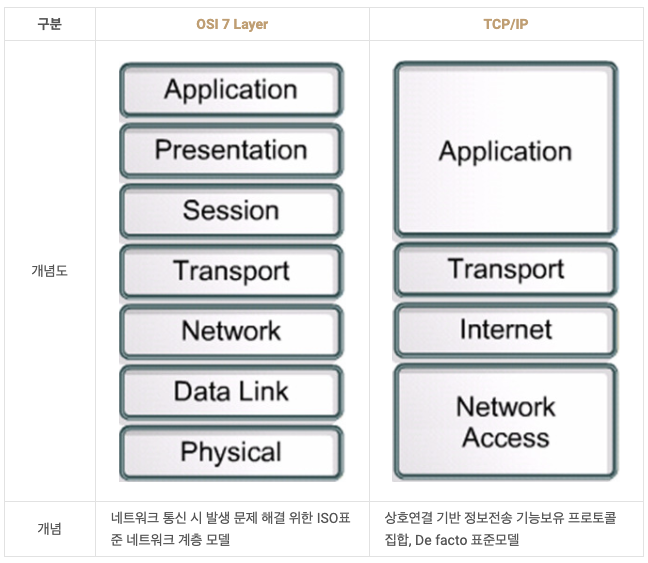

# OSI 7 계층 모델

- 국제표준화기구 ISO 에서 개발한 모델.  

- 네트워크 통신을 계층화해 계층 별 독립적인 역할 분담과 문제발생시 원인 파악을 용이하게 하기위해 개발한 표준 규격.  

- 각각의 계층별 프로토콜 데이터 단위를 맞추기 위해 상위계층에서 하위계층으로 내려갈수록 캡슐화, 하위계층에서 상위계층으로 올라갈수록 역캡슐화 진행.

## 각 계층 별 특징과 프로토콜

### 1계층. 물리 계층 Physical Layer

  - 장치간 정보 송/수신을 위한 전기/기계/기능적 세부 사항을 정의한다.
  - 노드간 데이터 전송에 집중하기때문에 데이터의 송수신 역할을 담당한다.
  - 디지털 비트를 전기/무선/광 신호로 변환 하는 기능 수행.
  - PDU : **bit**
  - 프로토콜 : 모뎀, RS-232 등

### 2계층. 데이터 링크 계층 Data Link Layer
  - 네트워크 계층에서 전달 받은 정보에 프레임 헤더/트레일러를 추가해 기기간 논리적 전송로를 정하는 방법을 규정.
  - 물리 계층을 통해 전달 받은 정보의 전송 오류를 감지하는 역할을 수행.
  - PDU : **Frame**
  - 프로토콜 : MAC, LAN 등 

### 3계층. 네트워크 계층 Network Layer

  - 기기간 연결을 위한 주소와 경로를 정하는 방법을 규정.
    - 최적 경로 설정, 패킷 정보 전송 등.
  - 여러개의 노드를 거칠 때 마다 경로를 찾는 역할.
  - 전송계층에서 전달 받은 정보를 적당한 크기로 쪼개고 각각에 헤더를 추가해 패킷을 생성.
    - 각각의 헤더는 논리주소를 포함.
  - PDU : **Packet**
  - 프로토콜 : IP, ICMP 등

### 4계층. 전송 계층 Transport Layer

  - 노드간 신뢰성 있고 정확한 정보 전송을 담당.
  - 네트워크 계층의 패킷 전송을 제어하는 역할.
    - 패킷 재전송, 에러복구, 흐름제어 등
  - 실질적인 정보 전송과 논리적 연결 사이 다리 역할.
  - PDU : **Segment**
  - 프로토콜 : TCP, UDP 등

### 5계층. 세션 계층 Session Layer

  - `포트번호`를 기반으로 통신 세션을 구성하고 상호작용과 동기화 제공. 연결 세션에서 에러복구, 데이터 교환을 담당.
  - 프로토콜 : SSH TLS 등

### 6계층. 표현 계층 Presentation Layer

  - 송/수신측간 데이터 형식을 정의.
  - 수신한 데이터를 변환, 검색, 암호화, 압축 등의 과정을 거져 올바른 방식으로 변환.
  - 문자의 인코딩 방식을 변환.
  - 프로토콜 : png, jpg 등

### 7계층. 응용 계층 Application Layer

  - 응용 프로그램의 정보를 활용하고 통신을 제어.
  - 사용자와 직접 상호작용하는 계층.
  - 프로토콜 : HTTP, SMTP, FTP 등

## TCP/IP 4 계층 모델과 비교

- 두 계층 모델간 개발 시기가 다르고 OSI 모델은 장비개발과 통신 자체에 대한 표준을 정의하고, TCP/IP 프로토콜을 사용한다.  

- OSI 모델이 표준과 학습도구로써의 의의가 있다면 TCP/IP 모델은 실무적인 통신 기술을 구현하는데 의미를 가진다.

### 공통점

- 계층별 역할
  - 캡슐화, 프로토콜 사용.
  - 계층간 역할을 정의.
- 통신 역할
  - 다중화, 역다중화
  - 페이로드 전송기능

### 차이점

- OSI 모델을 역할을 기반으로 각 계층을 구성하고, TCP/IP 모델을 프로토콜의 집합을 기반으로 구성된다.
- 전체적인 통신전반에 대한 표준화 방식이 OSI 모델이라면 TCP/IP 모델은 데이터 전송에 특화되어있다.

### OSI 7 계층으로 나누는 이유

- 통신 과정을 단계적으로 파악할 수 있고 트러블 슈팅을 용이하게 해주며 독립적인 계층으로 나누었을 경우 각 계층이 독립적으로 발전 할 수 있습니다

- 각 계층별로 역할을 나누어 특정 계층의 변경이 다른 계층에 영향을 미치지 않도록 하기 위함.

- 각 계층별로 표준화를 통해 다른 계층과의 상호작용을 통해 통신을 원활하게 하기 위함.