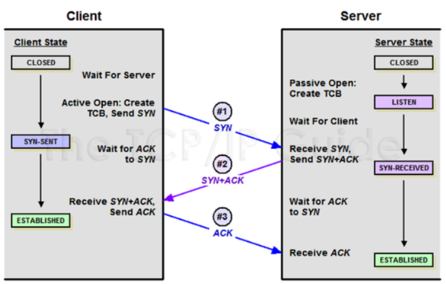
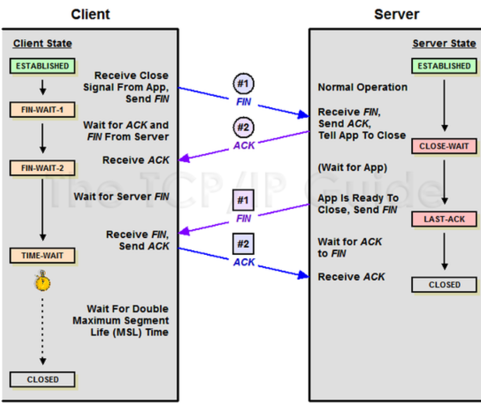

# TCP/IP 4계층 모델

- **Layer 4 - 전송 계층** : 송신자와 수신자 간의 신뢰성 있는 데이터 전송을 담당하는 계층

## TCP / UDP 란?

- 전송계층에서 사용하는 프로토콜
- 패킷을 한 곳에서 다른 곳으로 전송하는 역할을 하는 프로토콜
> **패킷** : 데이터를 전송할 때 일정한 크기로 나누어 전송하는 단위

### **TCP** (Transmission Control Protocol)
- 연결형 서비스를 제공하는 프로토콜 -> 수신여부를 확인하고, 데이터의 전송을 보장
- 데이터 전송 순서를 보장하며, 데이터의 유실을 방지 -> 신뢰도가 높지만 속도가 느림
- 신뢰성 있는 데이터 전송을 보장하기 위해 3-way handshaking, 4-way handshaking 등을 사용
- **흐름제어**와 **혼잡제어**를 제공
- 1:1 통신 방식
- 가상회선 패킷 교환방식을 사용
- ex) HTTP, HTTPS, FTP, SMTP 등

#### **가상회선 패킷 교환방식** 
- 데이터를 전송하기 위해 경로를 설정하고 데이터를 전송한 후 경로를 해제하는 방식
- 각 패킷에는 가상회선 식별자(VCI)가 포함되어 있어, 수신자는 이 식별자를 통해 데이터를 수신
- 모든 패킷을 전송하기 전에 경로를 설정하기 때문에 데이터의 순서가 보장되고, 데이터의 유실이 없다

#### **UDP** : User Datagram Protocol

- 비연결형 서비스를 제공하는 프로토콜 -> 데이터의 전송을 보장하지 않음
- 데이터 전송 순서를 보장하지 않으며, 데이터의 유실을 방지하지 않음 -> 신뢰도가 낮지만 속도가 빠름
- **흐름제어**와 **혼잡제어**를 제공하지 않음
- 1:1, 1:N, N:N 통신 방식
- 데이터그램 패킷 교환방식을 사용
- ex) DNS, Broadcasting, Streaming

#### **데이터그램 패킷 교환방식**
- 데이터를 전송하기 위해 경로 설정 없이 데이터를 전송하는 방식
- 각 패킷에는 수신자의 IP 주소와 포트번호가 포함되어 있어, 수신자는 이 정보를 통해 데이터를 수신
- 데이터를 전송하기 전에 경로를 설정하지 않기 때문에 데이터의 순서가 보장되지 않고, 데이터의 유실이 발생할 수 있음
- 하나의 메시지에서 분할된 여러 패킷은 서로 다른 경로로 전송될 수 있음
- 각 패킷은 독립적으로 이동하며 최단 경로로 전송되기 때문에 신속한 전송이 가능

 

## TCP의 연결 및 해제 과정

#### 포트(PORT) 상태 정보
- <b>CLOSED</b> : 포트가 닫힌 상태
- <b>LISTEN</b> : 포트가 열린 상태로 연결 요청 대기 중
- <b>SYN_RCV</b> : 요청을 받고 상대방의 응답을 기다리는 중
- <b>ESTABLISHED</b> : 포트 연결 상태

#### 플래그 정보
- TCP Header에는 CONTROL BIT(플래그 비트, 6bit)가 존재하며, 각각의 bit는 "URG-ACK-PSH-RST-SYN-FIN"의 의미를 가짐
- <b>SYN(Synchronize Sequence Number/000010)</b> : 연결 설정. Sequence Number를 랜덤으로 설정하여 세션을 연결하는 데 사용하며, 초기에 Sequence Number를 전송
- <b>ACK(Acknowledgement/010000)</b> : 응답 확인. 패킷을 받았다는 것을 의미
- <b>FIN(Finish/000001)</b> : 연결 해제. 세션 연결을 종료시킬 때 사용되며, 더 이상 전송할 데이터가 없음

###  [ TCP 연결 성립 과정 : 3-웨이 핸드 셰이크 ]

1. <b>SYN 단계</b> : 클라이언트는 서버에 클라이언트 ISN을 담아 SYN을 보냄
- ISN : 새로운 TCP 연결의 첫 번째 패킷에 할당된 임의의 시퀀스 번호, 장치마다 다를 수 있음

2. <b>SYN + ACK 단계</b> : 서버는 클라이언트의 SYN을 수신하고 ISN을 보내며 승인번호로 클라이언트의 ISN+1을 보냄

3. <b>ACK 단계</b> : 클라이언트는 서버의 ISN +1 한 값인 승인번호를 담아 ACK를 서버에 보냄

### [ TCP 연결 해제 과정 : 4-웨이 핸드 셰이크 ]

1. 클라이언트가 연결을 닫으려고 할 때 <b>FIN</b>으로 설정된 세그먼트 보냄, 클라이언트는 FIN_WAIT_1 상태로 들어가고 서버의 응답 기다림

2. 서버: 클라이언트로 <b> ACK승인 세그먼트 </b> 보냄, <b>CLOSE_WAIT</b> 상태 / 클라이언트 : FIN받기 위해 <b>FIN_WAIT_2</b> 상태

3. 서버: ACK를 보내고 일정 시간 후 클라이언트에 <b>FIN</b>이라는 세그먼트 보냄

4. 클라이언트: <b>TIME_WAIT</b> 상태, 서버로 해지 준비가 되었다는 <b>ACK</b>보냄 / 서버: CLOSED상태가 됨, 이후 클라이언트는 어느 정도의 시간을 대기한 후 연결이 닫히고 모든 자원의 연결이 해제됨

#### **TIME_WAIT**

- 소켓이 바로 소멸되지 않고 일정 시간 유지되는 상태
- 지연 패킷, 두 장치간 접속 오류 등 의도치 않은 에러로 인해 연결이 데드락으로 빠지는 문제점을 방지하는데 쓰임
- 연결이 끊어진 후 일정 시간 동안 클라이언트가 서버로부터 FIN을 받지 못한 경우, 클라이언트는 서버로부터 FIN을 받을 때까지 기다림